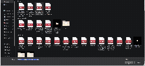

<h1 align="center">Online PDF Editor</h1>

<p align="center">
  <b>Edit the text inside a PDF in place — in the browser, with nothing uploaded.</b><br>
  Click a line, type over it, and the rest of the page stays exactly as it was:
  same fonts, same colours, same images, same layout.
</p>

<p align="center">
  <a href="https://sanaulislamzihad.github.io/Online-Pdf-Editor/">
    
  </a>
  <a href="https://github.com/sanaulislamzihad/Online-Pdf-Editor/actions/workflows/pages.yml">
    
  </a>
</p>

<p align="center">
  
  
  
  
  
  
  
</p>

<p align="center">
  <a href="https://sanaulislamzihad.github.io/Online-Pdf-Editor/">
    
  </a>
</p>

---

## The problem

Most "PDF editors" do one of two things to a file. They rebuild the page from
their own idea of what is on it, and the result is a document that looks
nearly right — shifted baselines, substituted fonts, a table that no longer
lines up. Or they refuse to touch the text at all and let you scribble a white
box over it.

This one changes the words and leaves everything else alone, byte for byte.
The file you download is the file you uploaded, with the lines you edited
rewritten in the document's own fonts.

## What it does

| | |
| --- | --- |
| ✏️ **Edit text in place** | Click any line and type. It stays in the typeface, size, colour and position it had. |
| 📐 **Wrap and reflow** | Text that outgrows its line breaks to the page's own measure, and the content below moves down to make room. |
| 🎨 **Restyle** | Size, colour, bold and italic per line, with one-point nudging. |
| 🖼️ **Edit images** | Drag to move, pull a corner to resize, replace with a PNG or JPEG, or delete. |
| 🔍 **Read text off pictures** | Scans, screenshots and pictures with words in them are recognised (English, Bangla, or both) and then edit like any other line. |
| 🇧🇩 **Bengali and mixed scripts** | Bangla and English in one line, including files whose character maps are written badly. |
| 🔒 **Private by construction** | No server, no upload, no account. The file is opened, edited and saved inside your own browser. |

## How to use it

**Online** — open [the editor](https://sanaulislamzihad.github.io/Online-Pdf-Editor/),
drop a PDF on the page or click to choose one. Try it with
[`docs/sample-report.pdf`](docs/sample-report.pdf) if you would rather not use
your own.

Then:

1. **Click a line** of text — it becomes editable where it sits.
2. **Type.** `Del` removes the line, `Esc` deselects, `Ctrl`+`Z` undoes.
3. **Use the panel** on the right for size, colour, weight and position.
4. **Click a picture** to drag, resize, replace or delete it — or to read the
   words inside it.
5. **Download.** The arrow at the top left goes back for another file.

**Locally**

```bash
git clone https://github.com/sanaulislamzihad/Online-Pdf-Editor.git
cd Online-Pdf-Editor
npm install
npm run dev          # http://localhost:5175
```

```bash
npm run build        # a static site in dist/ - host it anywhere
```

## Built with

| Tool | What it does here |
| --- | --- |
| **React 18** + **Vite 6** | The editor, and a build that is a folder of static files |
| **Tailwind CSS 3** | The interface, written once in a small set of shared parts |
| **pdf.js 4.8** | Reads the document: renders pages, pulls out every run of text with its font, size, colour and position |
| **pdf-lib 1.17** | Writes the document: rewrites content streams, embeds fonts and images, saves the file |
| **@pdf-lib/fontkit** | Parses embedded fonts, to measure text and to ask what glyphs a subset really carries |
| **Tesseract.js 7** | Recognises the words inside a scan or a screenshot, in English and Bangla |
| **Playwright** | End-to-end tests that check the exported file in Chrome's own PDF engine, not in the library that wrote it |
| **GitHub Actions → Pages** | Every push to `main` builds the site and publishes it |

No backend, no database, no third-party API. The only thing fetched at run
time is the recognition model, the first time you read a picture.

## How it stays faithful to the original

The interesting part of the project. Four problems, and what each one needed:

**Erasing without a white box.** Covering old text with a white rectangle
fails the moment a page has a coloured block, a photograph or a gradient
behind it. Instead the document is re-saved once with every glyph switched to
invisible render mode — page contents and form XObjects alike — and rendered.
That *plate* is the page with its text peeled off, so erasing a line means
stamping the matching slice of it back over the old glyphs. Whatever was
underneath comes back exactly.

**Rewriting in the document's own font.** The replacement is written with the
*same font resource* that drew the original, using that font's own character
codes, so nothing new is embedded and every reader draws the new text like the
line it replaced. That path is refused, rather than guessed at, when it cannot
be trusted — when a page has several font resources sharing one BaseFont, when
the font is a subset without a glyph for something newly typed, or for scripts
a PDF stores already shaped. Then the closest available face is used instead:
Carlito and Caladea are bundled as metric-for-metric clones of Calibri and
Cambria, and the panel names whichever face a line's new letters would be set
in.

**Making room.** A PDF has no flow: every line sits at a fixed place, so text
that gains a line has nowhere to put it. The page is opened up instead. Its
own drawing instructions go into a form XObject drawn twice — once clipped to
what is above the break and left where it is, once clipped to what is below
and translated down — so text, images and vector art come through as the very
objects they were, only lower.

**Reading a picture's typeface.** Recognition says what the words are, never
what they looked like. So each of the three families every PDF reader has is
drawn at the size that fills the line's own box and compared with the ink that
is really there; the best cover is the face the line is set in, and the size
that made it fit is its size. Weight is judged by how much ink there is rather
than where it is, because a picture has been screenshotted and scaled on its
way here, and that moves ink about without adding any.

## Layout of the code

| Path | What it does |
| --- | --- |
| `src/App.jsx` | The editor: what is open, what has been edited, what is selected |
| `src/components/` | Page canvas and overlay, the side panels, the shared interface parts |
| `src/lib/extract.js` | Loads a PDF, renders pages, pulls out text runs and their colours |
| `src/lib/plateBuild.js`, `plate.js` | Builds and serves the text-free background plate |
| `src/lib/nativeText.js` | Writes text with the page's own font resource |
| `src/lib/fonts.js` | Picks a font per script run, with fallbacks |
| `src/lib/paragraphs.js`, `reflow.js` | Finds paragraphs, re-sets them, opens the page up |
| `src/lib/images.js` | Finds the images on a page and where they sit |
| `src/lib/ocr.js` | Reads the text off a scan or a picture, and the face it is set in |
| `src/lib/export.js` | Erases and redraws the edited lines, saves the file |
| `tools/smoke.mjs` | End-to-end test; `tools/demo.mjs` records a scripted walk-through |

## Testing

With the dev server running:

```bash
npm run smoke -- path/to/file.pdf [outDir]
```

It opens the file, edits and restyles a line, exports, then renders the export
with **Chrome's own PDF engine** — deliberately not pdf.js, so a bug in how the
file is written cannot hide behind the library that wrote it. Screenshots of
the editor and of the exported file land in `outDir`.

## Known limits

- Replacement text still runs into whatever sits beside it on the same line: a
  page is opened up downwards, never sideways.
- Encrypted files fall back to flat colour patches, since their streams cannot
  be rewritten to build a plate.
- Recognised text is only as good as the recognition, and erasing it paints
  over the paper rather than peeling text away — invisible on a clean scan,
  a faint patch on a textured one.

## Credits

The fonts in `public/fonts/` — Noto Sans Bengali, Carlito and Caladea — are
under the SIL Open Font License; each licence sits alongside them.

Built by [Sanaul Islam Zihad](https://github.com/sanaulislamzihad).
